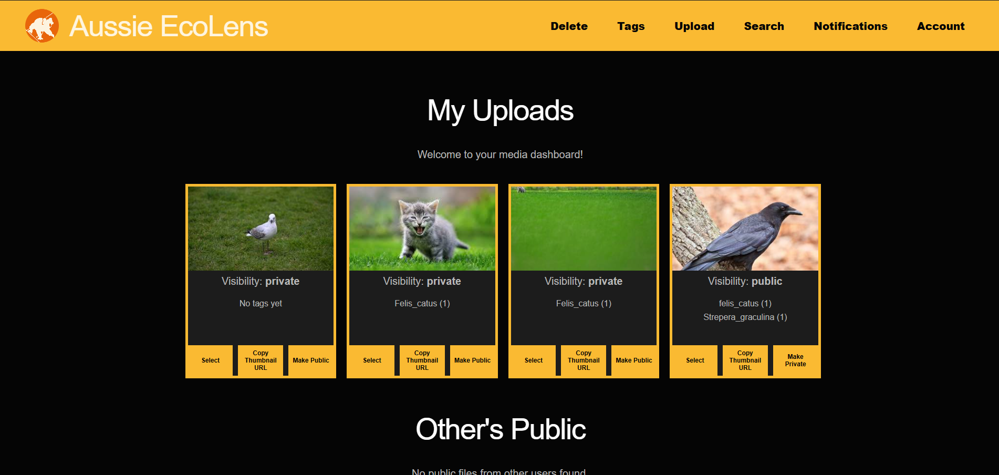

# Multi-Cloud Serverless Wildlife Media Tagging and Search Platform



This project is a serverless wildlife media platform. It allows users to upload wildlife images and videos, processes the media with ML-based species tagging, stores metadata, and supports querying, tag management, visibility changes, deletion, and tag notification workflows.

The project uses a multi-cloud architecture:

- AWS hosts the main application backend, including Cognito authentication, API Gateway, Lambda functions, S3 media storage, DynamoDB metadata, SNS notifications, and supporting IAM resources.
- GCP hosts the ML processor service for media inference through Cloud Run.
- Terraform manages permissive IAM roles and policies for Lambda functions.
- React, TypeScript, and Vite provide the frontend user interface.

## Project Directory

```text
.
|-- .github/       GitHub workflow and repository automation files.
|-- backend/       AWS Lambda functions, container functions, shared Python layers, GCP ML service code, base Docker images, and deployment scripts.
|-- docs/          Assignment files, architecture notes, infrastructure documentation, and generated diagrams.
|-- frontend/      React + TypeScript + Vite web application for upload, query, account, dashboard, notification, and tag workflows.
|-- models/        ML model weights used by local or deployed media processing components.
|-- terraform/     Terraform configuration, reusable modules, variables, outputs, and example variable files for cloud resources.
|-- tests/         Pytest integration tests and media fixtures for upload, query, and media-processing flows.
|-- .env           Local environment configuration file. Do not commit secrets.
|-- .gitignore     Git ignore rules for generated files, dependencies, secrets, and local artifacts.
|-- LICENSE        Project license.
`-- README.md      Top-level project overview and setup guide.
```

## Main Features

- User registration and authentication with AWS Cognito.
- Signed URL upload flow for images and videos.
- S3-backed media storage.
- Serverless media processing through Lambda and container-based functions.
- ML species tagging for wildlife media.
- Thumbnail generation and upload status tracking.
- Public and private media listing.
- Query APIs for tags, species, thumbnails, and query-file jobs.
- Tag subscription and notification workflow using SNS.
- Integration tests with sample wildlife media fixtures.

## Prerequisites

Install the following tools before running or deploying the project:

- Node.js and npm
- Python 3.12+
- AWS CLI v2
- Terraform 1.5+
- Docker, for container image builds
- Google Cloud CLI, for GCP ML processor deployment

## AWS Setup

For AWS Academy Learner Lab:

1. Start the AWS Academy Learner Lab.
2. Open **AWS Details**.
3. Copy the generated credentials into `~/.aws/credentials`.
4. Confirm access with:

```bash
aws sts get-caller-identity
```

To install AWS CLI v2 on Linux:

```bash
curl "https://awscli.amazonaws.com/awscli-exe-linux-x86_64.zip" -o "awscliv2.zip"
unzip awscliv2.zip
sudo ./aws/install
```

## Frontend Setup

Create an environment file under `frontend/.env`:

```bash
VITE_COGNITO_USER_POOL_ID="<Actual User Pool ID>"
VITE_COGNITO_USER_POOL_CLIENT_ID="<Actual Client ID>"
VITE_API_URL="<Actual API Gateway API URL>"
```

Run the frontend locally:

```bash
cd frontend
npm install
npm run dev
```

Useful frontend commands:

```bash
npm run build
npm run lint
npm run preview
```

## Backend And Infrastructure

Backend application code is stored under `backend/`:

- `backend/functions/` contains standard Python Lambda handlers.
- `backend/container_functions/` contains Docker-based function implementations for heavier processing tasks.
- `backend/layers/` contains shared Python utilities, schemas, species definitions, AWS resource helpers, and GCP ML client code.
- `backend/gcp/ml_processor/` contains the Cloud Run ML inference service.
- `backend/scripts/` contains deployment, verification, IAM, image build, and manual end-to-end scripts.

Terraform files are stored under `terraform/`. Start from the example variable file when configuring a deployment:

```bash
cd terraform
cp terraform.tfvars.example terraform.tfvars
terraform init
terraform validate
terraform plan
```

Do not commit real secrets, cloud credentials, generated service account keys, or environment-specific values.

## Tests

Integration tests live in `tests/` and use `pytest`. The test package includes media fixtures for image and video flows.

```bash
cd tests
uv sync
uv run pytest
```

Some tests expect deployed cloud resources and valid environment variables. Check `tests/integration/` and the backend verification scripts before running end-to-end flows.

## Documentation

Additional documentation is available in:

- `docs/infra/` for infrastructure notes and multi-cloud design.
- `docs/diagrams/` for architecture diagrams and generated Mermaid files.
- `docs/assignment/` for assignment specifications, rubric, and checklist material.
- `backend/gcp/ml_processor/README.md` for the GCP ML service contract.

## Security Notes

- Keep `.env`, cloud credentials, service account keys, and Terraform variable files with secrets out of commits.
- Use short-lived AWS Academy credentials where required.
- The GCP ML processor expects signed requests from AWS using timestamp and HMAC headers.
- Review `.gitignore` before adding new generated files or local deployment artifacts.
